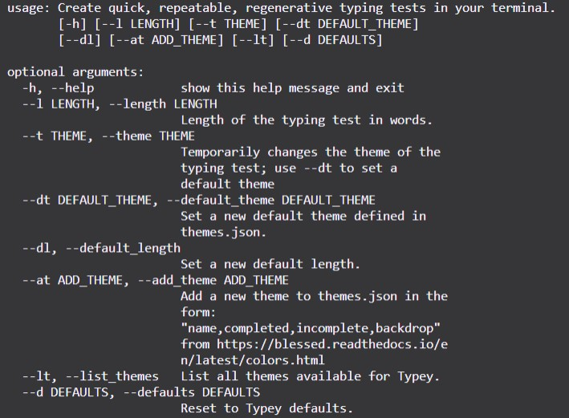

# Typey

Typey is a minimalistic, terminal-based typing test inspired from the likes of [typings.gg](https://typings.gg/) and [monkeytype.gg](https://monkeytype.com/).

Typey was created with the intention of improving the efficiency of time-wasting. Busy doing something important and you're using a terminal? Typey. Struggling with the command line because programming is hard? Typey. Staring at your monitor because even though you have a million things you *could be doing* you don't feel like doing anything at all? Typey.

## Getting Started

Typey can be installed from PyPI:

`pip install typey`

The extremely overpopulated help menu can be accessed with:

`typey --h`

By default, Typey will start with a 25 word typing test because it's quick and allows you to pad your WPM - I mean be productive. Pressing tab at any time during the test will REDO (REDO REDO REDO); pressing ESC at any point will exit the test and allow you to move on with your life.

Furthermore, there is a themes JSON file that includes a couple of GMK gems such as minimal and hyperfuse; this can be modified to include any number of themes using the colour codes provided by [blessed](https://blessed.readthedocs.io/en/latest/colors.html#).

For example, GMK Minimal is provided internally by:

"minimal": {
        "c": "grey_on_white",
        "i": "black_on_white",
        "b": "on_white"
    },

This is equivalent to "typey --at "minimal, grey_on_white, black_on_white, on_white".